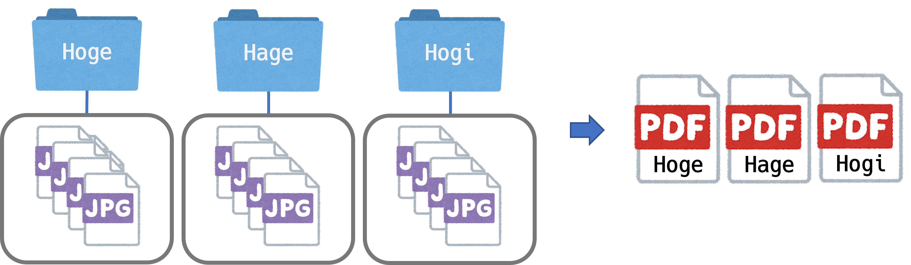

### 概要

  フォルダ下に保存された複数の画像を１つのPDFファイルにまとめられます。

### インストール
 ```
 pip install -r requirements.txt
 ```

### 実行
```
python main.py
```
実行するとGUIアプリケーションが起動します.
読み込み先フォルダを参照するとリストに、画像が保存されているフォルダの一覧が表示されます.一覧の中から、PDFに変換したいフォルダを選択し、出力先フォルダを参照後、実行ボタンを押すと、PDFが生成されます.


